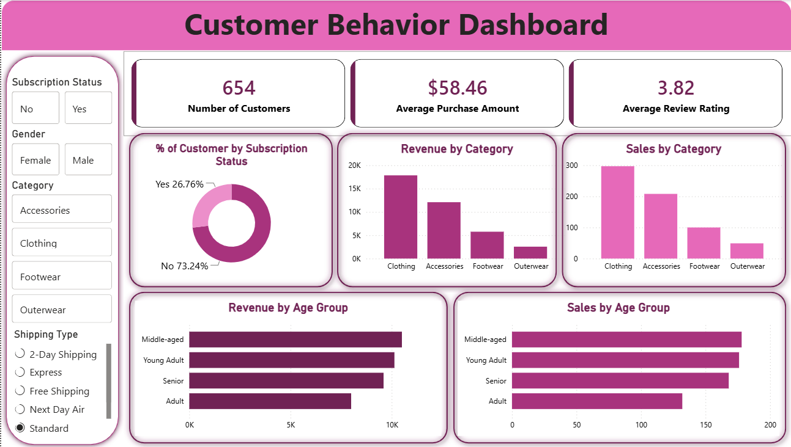

# 🛍️ Customer Behavior Analysis Dashboard

An end-to-end data analytics project that analyzes customer behavior using **Python** and presents interactive business insights through a **Power BI Dashboard**.

## 📌 Project Overview

This project focuses on understanding customer purchasing behavior by cleaning and analyzing customer data using Python and visualizing key insights in Power BI.

The dashboard helps businesses identify customer trends, purchasing patterns, and demographic insights, enabling data-driven decision-making.

---

## 🎯 Objectives

- Analyze customer purchasing behavior.
- Clean and preprocess the dataset.
- Perform Exploratory Data Analysis (EDA).
- Build an interactive Power BI dashboard.
- Generate actionable business insights.

---

## 🛠️ Tools & Technologies

- **Python**
- **Pandas**
- **NumPy**
- **Matplotlib**
- **Seaborn**
- **Power BI**
- **Jupyter Notebook**

---

## 📂 Project Structure

```
customer_behavior/
│
├── Customer_Behavior_Analysis.ipynb
├── Customer_Behavior_Dashboard.pbix
├── customer_data.csv
├── Dashboard.png  
└── README.md
```

---

## 📊 Project Workflow

1. Data Collection
2. Data Cleaning
3. Exploratory Data Analysis (EDA)
4. Feature Analysis
5. Data Visualization using Python
6. Dashboard Creation in Power BI
7. Business Insights

---

## 📈 Dashboard Features

The Power BI dashboard includes:

- 📌 Total Customers
- 💰 Total Sales
- 📦 Total Orders
- 👥 Customer Demographics
- 📍 Regional Sales Analysis
- 🛒 Purchase Trends
- 📊 Category-wise Sales
- 📈 Monthly Sales Trend
- 🎛️ Interactive Filters and Slicers

---

## 📸 Dashboard Preview

> Upload screenshots inside the **images** folder and update the file names below.

```markdown


```

---

## 🚀 How to Run

### Clone Repository

```bash
git clone https://github.com/mansi-indalkar/customer_behavior_.git
```

### Install Required Libraries

```bash
pip install pandas numpy matplotlib seaborn
```

### Open Power BI Dashboard

Open the file:

```
Customer_Behavior_Dashboard.pbix
```

using **Microsoft Power BI Desktop**.

---

## 📌 Key Insights

- Identified purchasing trends across customer segments.
- Compared sales performance by category and region.
- Analyzed customer demographics.
- Found high-performing products and customer groups.
- Built an interactive dashboard for business decision-making.

---

## 💡 Skills Demonstrated

- Data Cleaning
- Exploratory Data Analysis (EDA)
- Data Visualization
- Power BI Dashboard Development
- Data Storytelling
- Business Analytics
- Python Programming

---

## 📬 Connect with Me

**Mansi Indalkar**

- 💼 LinkedIn: https://www.linkedin.com/in/mansi-indalkar/
- 💻 GitHub: https://github.com/mansi-indalkar

---

⭐ If you found this project helpful, consider giving it a **Star** on GitHub!
